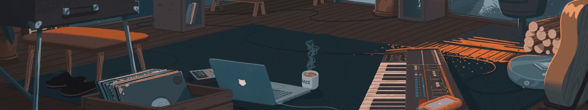

[](https://github.com/ariviscomi)

<div align="center">

# Ariel Viscomi

**`IT @ INVAP · Dev en Transición · Maker Patagónico`**

*Construyendo tecnología desde la Patagonia, a orillas de un lago 🏔️*

[](https://www.linkedin.com/in/ariel-viscomi/)
[](mailto:arielviscomi.mail@gmail.com)

</div>

---

## 🔭 Ahora mismo

```
💼  IT Support Technician  →  Dev / DevOps / IA
🐍  Diplomatura Python · UTN FRBA  (desde abril 2026)
🤖  Automatización, sistemas embebidos, robótica
🎵  Producción musical bajo el alias Cachorro
🌍  Bariloche, Patagonia, Argentina
```

---

## 🛠 Stack

<div align="center">

#### Lenguajes


#### Frameworks & Herramientas


#### Bases de Datos


#### En camino 🚧


</div>

---

## 📌 Proyectos

| Proyecto | Descripción | Stack | Estado |
|---|---|---|---|
| **[Ticketly](#)** | Frontend para gestión de tickets de soporte | React · JS | 🔧 En desarrollo |
| **[Hormiga Artesana](#)** | Plataforma e-commerce para artesanos | React · JS | 🔧 En desarrollo |
| **[Amoblamientos Patagónicos](https://github.com/ariviscomi/amoblamientos_patagonicos_v1)** | Sitio catálogo estático para showroom local | HTML · CSS | ✅ Live |
| **[MSNTS Web](https://github.com/ariviscomi/msnts_web)** | Sitio web para banda de rock | HTML · CSS · JS | ✅ Live |

---

## 📊 Stats

<div align="center">

[](https://github.com/ariviscomi)
[](https://github.com/ariviscomi)

[](https://github.com/ariviscomi)

</div>

---

## 🎵 Cachorro

Músico y productor independiente bajo el alias **[Cachorro](#)** — rock, metal progresivo, electrónica.  
Donde el código termina, empieza el ruido.

---

## 🤝 Contacto

[](https://www.linkedin.com/in/ariel-viscomi/)
[](mailto:arielviscomi.mail@gmail.com)

---

[](https://github.com/ariviscomi)
